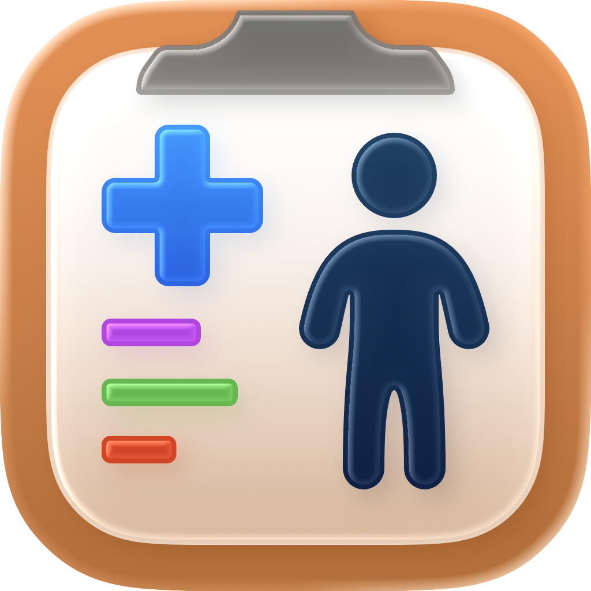

# ✨ CommunityKit 2025 — Feature List ✨
> A celebration of the incredible apps crafted for **OS 26** and beyond.  

---

## 🎉 Welcome!
The 2025 **CommunityKit Release Feature List** is your stage to share what you’ve built this year.  
Whether your app is shimmering with **Liquid Glass**, powered by **Foundation Models**, chiming with **AlarmKit**, or simply refined with a thoughtful update — we want to celebrate **all of it**.  

Because sometimes the most powerful thing you can do for your users isn’t adopting the latest framework — it’s releasing an update that makes life better, smoother, and more joyful. 🌱  

---

## 📦 How to Contribute
All you need to do is **add your app as a new row in the table below**.  
Please include:  

- **App Name**  
- **Description** (≤200 characters)  
- **Platforms** (badges are provided below for convenience)  
- **App Icon** (place inside `Resources/<YourAppName>/>FileName>.png`)  
- **App Store ID or URL**  
- **Website / Press Kit link**  

---

## 📝 Example Submission (YAML reference)
This example shows the fields you’ll be adding to the table:  

```yaml
name: Your Awesome App
description: A great app that does amazing things stylishly.
platforms: [iOS, tvOS]
app_id: 6730000000
app_icon: ./Resources/YourAwesomeApp/yourawesomeapp.png
website: https://yourawesomeapp.com
```
## Note
- Please make sure you're setting your image to be 128x128 in size within the table.

---

## 📚 Submissions
Here’s the showcase of apps submitted for **CommunityKit 2025**! 🎉  

| Icon | App | Description | Platforms | Links |
|------|-----|-------------|-----------|-------|
|  | **Pediapal** | A child health monitor that helps parents track vitals, medications, and routines. |  | [App Store](https://apps.apple.com/app/id6739232517) · [Website](https://pediapal.app) |

---

## 🛠 Platform Badges
Copy and paste these as needed for the **Platforms** column:  

-   
-   
-   
- 
-   

---

✨ Want to see your app here? Add your row to the table and open a PR!  
