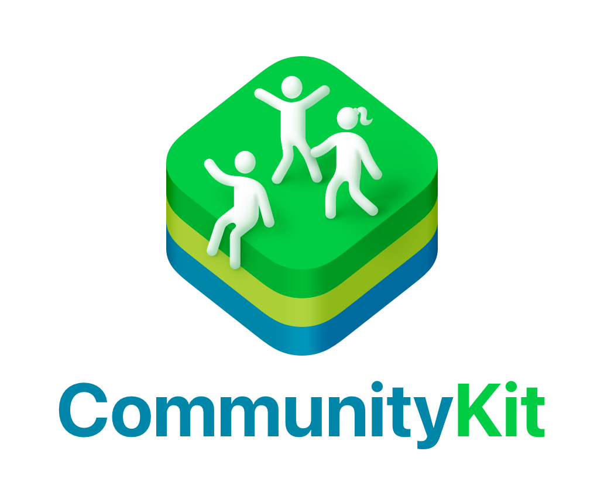
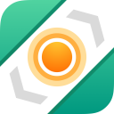

  

# ✨ CommunityKit OS 26 — Feature List ✨
> A celebration of the incredible apps crafted for **OS 26** and beyond.

---

## 🎉 Welcome!
The **CommunityKit Release Feature List** is your stage to share what you’ve built this year.  
Whether your app is shimmering with **Liquid Glass**, powered by **Foundation Models**, chiming with **AlarmKit**, or simply refined with a thoughtful update — we want to celebrate **all of it**.

Because sometimes the most powerful thing you can do for your users isn’t adopting the latest framework — it’s releasing an update that makes life better, smoother, and more joyful. 🌱

---

## 📦 How to Contribute
All you need to do is **add your app as a new row in the table below**.
Make sure to follow the intended format.

**Requirements to be included**
- Your app must be **approved for distribution** — e.g. **live on the App Store** or **approved and in Pending Developer Release / Pending Apple Release**.  
- Apps still **in development** or **pending approval** are **not yet eligible**.

**Please include**
- **App Icon** (place inside `Resources/<YourAppName>/<FileName>.png` and then get the url. Eg. https://github.com/community-kit/CommunityKit-Release-Feature-List/blob/main/Resources/Pediapal/pediapal.png)  
- **App Name**  
- **Description** (≤200 characters)  
- **Platforms** (see badges provided below)  
- **App Store URL** 
- **Website / Press Kit link**

**Write it in the following format**

|  | **App Name** | Description ≤200 characters |  | [App Store](https://developer.apple.com) · [Website](https://communityKit)

---

## 📝 Example Submission
This example mirrors the fields you’ll add to the table.

|  | **Pediapal** | A child health monitor that helps parents track vitals, medications, and routines. |  | [App Store](https://apps.apple.com/app/id6739232517) · [Website](https://pediapal.app) |

---

## 🛠 Platform Badges
Copy/paste these into the **Platforms** column as needed:

-   
-   
-   
-   
- 

---

## 📚 Submissions
Here’s the showcase of apps submitted for **CommunityKit 2025**! 🎉

| Icon | App | Description | Platforms | Links |
|------|-----|-------------|-----------|-------|
|  | **Pediapal** | A child health monitor that helps parents track vitals, medications, and routines. |  | [App Store](https://apps.apple.com/app/id6739232517) · [Press Kit](https://pediapal.notion.site/) |
|  | **Please Don't Rain** | Please Don’t Rain is a fun, convenient way to track whether weather will affect a day that’s important to you. |  | [App Store](https://apps.apple.com/us/app/please-dont-rain/id6444577668) · [Press Kit](https://chriswu.com/pdr_press/) |
|  | **PocketShelf** | PocketShelf is a beautiful reading tracker that helps you finish your books. |  | [App Store](https://apps.apple.com/app/apple-store/id6745476834) · [PressKit](https://impresskit.net/0404d5df-91f3-4787-9628-8f59fb21a5d3) |
|  | **Art of Fauna** | The Art of Fauna is a relaxing puzzle game about the animal world. Apple Design Award Winner 2025. |  | [App Store](https://apps.apple.com/us/app/art-of-fauna-cozy-puzzles/id1630468596) · [Website](https://theartof.app/fauna/) |
|  | **Nunch** | The simplest, most delightful way to track your calories and macros. |  | [App Store](https://apps.apple.com/app/id6670322395) · [Website](https://nunch.app) |
|  | **Transcrybe** | Subtitles for everything! Live translate and caption any audio on your mac. |  | [App Store](https://apps.apple.com/app/id6670778781) · [Website](https://transcrybe.app) |
|  | **Dark Noise** | White noise, refined. |   | [App Store](https://apps.apple.com/us/app/dark-noise/id1465439395) · [PressKit](https://darknoise.app/posts/dark-noise-3_5) |
|  | **Framous** | Quickly add device frames around your screenshots. |  | [App Store](https://apps.apple.com/app/id6636520519) · [PressKit](https://charliemchapman.notion.site/Framous-PressKit-19f0e35f1ff7806f95f6df2d378d8d42) |
|  | **NowPlaying: Music Discovery** | Escape your music bubble, break out of the algorithm! Learn great details about any music and discover new music along the way. A must-have for every music fan! |     | [App Store](https://apps.apple.com/app/apple-store/id1596487035) · [Website](https://nowplaying.page) |
|  | **GO Club** | GO Club is a step counter for casual walkers that helps you move more, stay hydrated, and build healthy habits with simple, motivating features. |  | [App Store](https://apps.apple.com/us/app/go-club-step-counter/id6739782103) |
|  | **Chronicling** | Chronicling helps you track habits, health, and any details of your daily life - with beautiful charts, interactive widgets, controls and shortcuts |      | [App Store](https://apps.apple.com/us/app/chronicling/id6445992145) · [Website](https://www.chroniclingapp.com) |
|  | **Vinyl Fetish** | The music player that replicates the vinyl experience. |  | [App Store](https://apps.apple.com/app/id1490719457) · [PressKit](https://impresskit.net/8d65c118-675e-44e0-a92c-a25456592a6e) | 
|  | **Tasks** | One-size-fits-all works for socks, not for managing your life. Tasks gives you the freedom to customize your projects, tasks, and workflow your way. |      | [App Store](https://apps.apple.com/app/id1502903102) · [PressKit](comming soon) |
|  | **Vinyl Fetish** | The music player that replicates the vinyl experience. |  | [App Store](https://apps.apple.com/app/id1490719457) · [PressKit](https://impresskit.net/8d65c118-675e-44e0-a92c-a25456592a6e) |
|  | **CardPointers** | Get the most points and cash back from your credit cards every day. |     | [App Store](https://apps.apple.com/app/id1472875808) · [Website](https://cardpointers.com) [Press Kit](https://cardpointers.com/presskit) |
|  | **Finma** | Automate your finances using AI. |  | [App Store](https://apps.apple.com/app/id6446134557) · [Website](https://finma.money) |
|  | **Wheelie** | Your perfect handlebar companion–a clean, modern cycling app with live map, speedometer, and compass. |  | [App Store](https://apps.apple.com/in/app/wheelie-bike-ride-tracking/id6747010503) · [Press Kit](https://wheelieapp.com/press.html) |
|  | **Sidecar**: Automotive assistant | Navigation, OBD, and CarPlay widgets. |  | [App Store](https://apps.apple.com/app/id1663683832) · [Website](https://sidecar.clutch.engineering/) |
|  | **Liftin' - Gym Workout Tracker** | Uniquely simple yet suprisingly advanced gym tracker app. |   | [App Store](https://apps.apple.com/app/id1445041669) · [Website](https://liftinapp.co) |
|  | **Bikemap** | Plan, navigate and track your rides quickly and easily.  |    | [App Store](https://apps.apple.com/app/bikemap-cycling-tracker-gps/id625759466) · [Website](https://bikemap.net) |
|  | **Sticky Widgets** | Ridiculously simple home screen sticky notes |   | [App Store](https://apps.apple.com/us/app/sticky-widgets/id1533254320?ct=community-kit) · [Website](https://stickywidgets.app) |
|  | **AppJournal - Indie App Diary** | Keep track of changes & milestones in your apps. |    | [App Store](https://apps.apple.com/app/id6476312652) · [Website](https://adamfoot.dev/apps/appjournal) |
|  | **Alyx** | A silly way to track acaffeine. |  | [App Store](https://itunes.apple.com/us/app/id6473840226) · [Website](https://alyxcaffeinetracker.com) |
|  | **Bullseye - Apple Search Ads Manager for Mac** | Native Apple Search Ads manager for macOS. |  | [App Store](https://apps.apple.com/app/id6741164141) · [Website](https://adamfoot.dev/apps/bullseye) |
|  | **Haptics - Test Haptic Feedback** | Test different haptic feedback styles to add them to your own app. |     | [App Store](https://apps.apple.com/app/id1474606532) · [Website](https://adamfoot.dev/apps/haptics) |
|  | **HomeBatteries - HomeKit Battery Status** | View all HomeKit accessory battery levels & get notified when they run low. |    | [App Store](https://apps.apple.com/app/id6450958030) · [Website](https://adamfoot.dev/apps/homebatteries) |
|  | **HomeButtons - Quick HomeKit Controls** | Quick toggles for HomeKit scenes & accessories across multiple Apple platforms. |    | [App Store](https://apps.apple.com/app/id1561615144) · [Website](https://adamfoot.dev/apps/homebuttons) |
|  | **MediID - Medical ID for iPhone & Apple Watch** | Full medical ID for iPhone & Apple Watch. |   | [App Store](https://apps.apple.com/app/id1082212650) · [Website](https://adamfoot.dev/apps/mediid) |
|  | **MediSOS - Medical Alert Siren** | Emergency siren to get attention in the event of a medical emergency. |   | [App Store](https://apps.apple.com/app/id1080191188) · [Website](https://adamfoot.dev/apps/medisos) |
|  | **MediWear - Medical ID for Apple Watch** | Full medical ID for Apple Watch. |   | [App Store](https://apps.apple.com/app/id1080197914) · [Website](https://adamfoot.dev/apps/mediwear) |
|  | **MediWidget - Medical ID Widgets** | Medical ID widgets for Home & Lock Screens. |  | [App Store](https://apps.apple.com/app/id1078072349) · [Website](https://adamfoot.dev/apps/mediwidget) |
|  | **RetroBoard - T9 Keyboard for Apple Watch** | T9 style keyboard for Apple Watch with predictive text. |   | [App Store](https://apps.apple.com/app/id1465643346) · [Website](https://adamfoot.dev/apps/retroboard) |
|  | **Shutters for SOMA Connect** | Control SOMA blinds & shades. |   | [App Store](https://apps.apple.com/app/id6450449079) · [Website](https://adamfoot.dev/apps/shutters) |
|  | **StyleGuide - HIG Menubar App** | Quickly preview Apple HIG typography, colors & more! |  | [App Store](https://apps.apple.com/app/id6503706164) · [Website](https://adamfoot.dev/apps/styleguide) |
|  | **Territory - App Store Storefront Switcher** | Quickly switch App Store storefronts for ASO purposes. |      | [App Store](https://apps.apple.com/app/id1454112177) · [Website](https://adamfoot.dev/apps/territory) |
|  | **TV Remote - Universal Remote** | A fully customisable remote app for Apple platforms. |    | [App Store](https://apps.apple.com/app/id1539419805) · [Website](https://adamfoot.dev/apps/tvremote) |
|  | **WristBoard - Keyboard for Apple Watch** | Full keyboard for Apple Watch. |   | [App Store](https://apps.apple.com/app/id1452694750) · [Website](https://adamfoot.dev/apps/wristboard) |
|  | **TimeWave - Timer Chains** | Flowing Timers for Sequential Tasks. |    | [App Store](https://apps.apple.com/app/id1524345488) · [Website](https://timewave.webflow.io/presskit) |
|  | **Docker Manager GUI - WhaleDeck** | Docker management and monitoring made easy. |   | [App Store](https://apps.apple.com/app/1581548562) · [Website](https://whaledeck.app) |
|  | **Fuel Consumption – DriveDex** | Your vehicles' best buddy for logging consumption, expenses, and maintenance. |    | [App Store](https://apps.apple.com/app/6503341002) · [Website](https://drivedex.app) |
|  | **Where To?** | Discover the best locations worldwide on iPhone and Apple Watch: Where To? finds the closest and best rated places to eat, shop, party, and relax. Get detaild information including how to get there. |    | [App Store](https://apps.apple.com/app/id903955898) · [Website](https://whereto.app) |
|  | **Streets** | Streets is the best way to browse Street View panoramas on iPhone, iPad and Apple Watch. An interactive mini map, a timeline and more unique features provide the ultimate Street View experience. |    | [App Store](https://apps.apple.com/app/id1071879826) · [Website](https://streets.app) |
|  | **Dateminder** | Effortlessly keep track of birthdays and special events with Dateminder! |  | [App Store](https://apps.apple.com/app/apple-store/id6480020164) · [Website](https://bigfatapps.com)
|  | **Sticker Book for iMessage Gifs** | Collect and send the cutest stickers in iMessage and WhatsApp! |  | [App Store](https://apps.apple.com/app/id1672483469) |

---
✨ Want to see your app here? **Add your row** to the table and **open a PR!**
